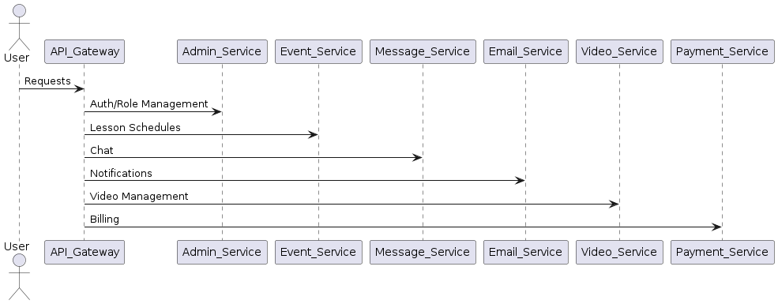
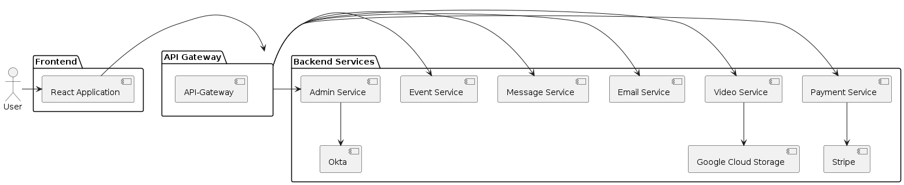

# SPEC-001: Functional Requirements Specification for Turbolessons

## Background

>  **Turbolessons is designed for music teachers to manage their teaching activities effectively. It includes functionalities for billing students, scheduling lessons, and uploading documents and video content. The backend is built using Spring Boot, providing RESTful services consumed by a React-based frontend. The architecture comprises several microservices, each with a specific responsibility:**
>  
>  *  config-server: A Spring Cloud Config Server for centralized configuration management.
>  *  service-registry: A Eureka server for service discovery.
>  *  api-gateway: A Spring Cloud Gateway service for routing and load balancing.
>  *  admin-service: Manages authentication and user management using Okta as the identity provider.
>  *  event-service: Manages lesson schedules.
>  *  message-service: A WebSocket chat server for messaging.
>  *  email-service: A background email server for sending scheduled reminders and notifications.
>  *  video-service: Interfaces with Google Cloud Storage to serve video data.
>  *  payment-service: Integrates with Stripe for managing subscription-based billing.
>  *  turbolessons-frontend: A React application serving as the frontend.


## Requirements

>  **The frontend for Turbolessons must support the following user roles and functionalities:**
>  
>  ### User Roles and Permissions
>  
>  1. **Admins**
>      * Can create teachers and students.
>      * View and edit billing information.
>      * View and edit all video data.
>      * View and edit email history and notification options.
>      * Send chat messages to any user.
>      * View and edit lesson event data for any user.
>  
>  2. **Teachers**
>      * View billing history for their own students.
>      * View and edit their own video data.
>      * View and edit email history and notification options for their own students.
>      * Send chat messages to any user.
>      * View and edit lesson event data for their own students.
>  
>  3. **Students**
>      * View their own billing history.
>      * View and edit their payment methods
>      * View video data owned by their teacher.
>      * View and edit email history and notification options for themselves.
>      * Send chat messages to their teacher and admins.
>      * View lesson event data for themselves.

### Functional Requirements

>  **The frontend must interact with the following backend components to support its functionality:**
>  
>  1. **Admin Service**
>      * Manages user authentication and roles.
>      * Integrates with Okta for identity management.
>  
>  2. **Event Service**
>      * Handles the creation, updating, and deletion of lesson schedules.
>      * Sends notifications and reminders for upcoming lessons.
>  
>  3. **Message Service**
>      * Provides real-time chat functionality using WebSocket.
>  
>  4. **Email Service**
>      * Sends automated email notifications for lesson reminders and billing notifications.
>  
>  5. **Video Service**
>      * Manages the upload and retrieval of video content.
>      * Integrates with Google Cloud Storage.
>  
>  6. **Payment Service**
>      * Handles billing and subscription management.
>      * Integrates with Stripe for payment processing.
>  
>  7. **API Gateway**
>      * Routes requests from the frontend to the appropriate microservice.
>      * Provides load balancing to ensure efficient distribution of requests.
>      * Handles security, logging, and monitoring of API requests.


## Method

>  **The frontend application for Turbolessons will be implemented using React and will interact with various backend services through a well-defined API Gateway. The following subsections detail the architecture design, component interactions, and database schemas necessary to meet the functional requirements.**
>  
>  ### Architecture Design
>  
>  The architecture of Turbolessons-frontend is based on a microservices pattern, with each microservice responsible for a specific functionality. The API Gateway acts as the single entry point for all client requests, routing them to the appropriate backend services.
>  
>  [plantuml, turbolessons_architecture, png]
>  ----
>  
>  ----
>  
>  ### Component Interactions
>  
>  1. **User Authentication and Role Management**
>      - The frontend will communicate with the Admin Service through the API Gateway to handle user authentication and role management. Okta will be used for identity management, ensuring secure login and role-based access control.
>  
>  2. **Lesson Scheduling**
>      - The Event Service will manage lesson schedules. The frontend will interact with this service to create, update, view, and delete lesson events. Notifications for upcoming lessons will also be handled by this service.
>  
>  3. **Real-time Messaging**
>      - The Message Service will provide real-time chat functionality using WebSocket. The frontend will enable users to send and receive messages instantly, ensuring effective communication between teachers, students, and admins.
>  
>  4. **Email Notifications**
>      - The Email Service will send automated email notifications for lesson reminders, billing notifications, and other relevant alerts. The frontend will allow users to view and manage their email history and notification preferences.
>  
>  5. **Video Management**
>      - The Video Service will handle the upload and retrieval of video content. The frontend will provide interfaces for teachers to upload lesson videos and for students to view these videos. Integration with Google Cloud Storage ensures scalable and secure video storage.
>  
>  6. **Billing and Subscription Management**
>      - The Payment Service, integrated with Stripe, will manage all billing and subscription processes. The frontend will enable users to view billing history, manage subscriptions, and make payments securely.
>  
>  ### Data Objects
>  
>  The frontend itself does not manage databases directly, but it will interact with backend services that do. Below are simplified schemas for key backend services:
>  
>  #### Admin Service (User and Role Management)
>  
>  | Table Name | Columns                               |
>  |------------|---------------------------------------|
>  | Users      | id, username, password, email, role   |
>  | Roles      | id, role_name                         |
>  
>  #### Event Service (Lesson Scheduling)
>  
>  | Table Name | Columns                              |
>  |------------|--------------------------------------|
>  | Lessons    | id, teacher_id, student_id, datetime, status, notes |
>  
>  #### Message Service (Chat)
>  
>  | Table Name | Columns                              |
>  |------------|--------------------------------------|
>  | Messages   | id, sender_id, receiver_id, message, timestamp |
>  
>  #### Email Service (Notifications)
>  
>  | Table Name     | Columns                                      |
>  |----------------|----------------------------------------------|
>  | Email_History  | id, user_id, email_content, sent_timestamp   |
>  | Notifications  | id, user_id, notification_content, status    |
>  
>  #### Video Service (Video Management)
>  
>  | Table Name | Columns                              |
>  |------------|--------------------------------------|
>  | Videos     | id, teacher_id, title, description, url, upload_timestamp |
>  
>  #### Payment Service (Billing)
>  
>  | Table Name | Columns                                 |
>  |------------|-----------------------------------------|
>  | Payments   | id, user_id, amount, currency, status, payment_date |
>  | Subscriptions | id, user_id, plan, start_date, end_date, status |
>  
>  ### Component Diagrams
>  
>  Here are the detailed component diagrams for the key functionalities:
>  
>  ----
>  
>  ----

## Implementation

>  The implementation of Turbolessons-frontend involves several steps to ensure that the React application is properly integrated with the backend services and the overall architecture. Below are the detailed implementation steps:
>  
>  ### Step 1: Set Up the Development Environment
>  
>  1. **Install Node.js and npm**
>      - Ensure that Node.js and npm (Node Package Manager) are installed on your development machine.
>      - You can download and install them from the official Node.js website.
>  
>  2. **Create a New React Application**
>      - Use Create React App to bootstrap a new React application.
>      - Run the following command:
>      ```bash
>      npx create-react-app turbolessons-frontend
>      ```
>  
>  3. **Set Up Project Structure**
>      - Organize the project structure to separate concerns such as components, services, utilities, and styles.
>      - Create directories for components, services (for API calls), and styles.
>  
>  ### Step 2: Configure API Gateway Integration
>  
>  1. **Install Axios**
>      - Use Axios for making HTTP requests to the API Gateway.
>      - Install Axios by running:
>      ```bash
>      npm install axios
>      ```
>  
>  2. **Create an API Service**
>      - Create a service file (e.g., `apiService.js`) to handle all API interactions.
>      - Configure Axios to use the base URL of the API Gateway.
>  
>      ```javascript
>      import axios from 'axios';
>  
>      const api # axios.create({
>          baseURL: 'https://api.turbolessons.com', // Replace with actual API Gateway URL
>          headers: {
>              'Content-Type': 'application/json',
>          },
>      });
>  
>      export default api;
>      ```
>  
>  ### Step 3: Implement Authentication and Authorization
>  
>  1. **Integrate with Okta**
>      - Install the Okta Auth SDK and React SDK.
>      ```bash
>      npm install @okta/okta-auth-js @okta/okta-react
>      ```
>  
>      - Configure Okta in your React application by creating an `Auth.js` file.
>  
>      ```javascript
>      import { Security, LoginCallback } from '@okta/okta-react';
>      import { OktaAuth } from '@okta/okta-auth-js';
>      import { BrowserRouter as Router, Route } from 'react-router-dom';
>  
>      const oktaAuth # new OktaAuth({
>          issuer: 'https://{YourOktaDomain}/oauth2/default', // Replace with your Okta domain
>          clientId: '{ClientId}', // Replace with your Okta client ID
>          redirectUri: window.location.origin + '/login/callback',
>      });
>  
>      function App() {
>          return (
>              <Router>
>                  <Security oktaAuth#{oktaAuth}>
>                      {/* Your Routes Here */}
>                      <Route path#'/login/callback' component#{LoginCallback} />
>                  </Security>
>              </Router>
>          );
>      }
>  
>      export default App;
>      ```
>  
>  2. **Create Protected Routes**
>      - Protect routes that require authentication using the `SecureRoute` component from Okta.
>  
>      ```javascript
>      import { SecureRoute } from '@okta/okta-react';
>      // Other imports
>  
>      <SecureRoute path#'/dashboard' component#{Dashboard} />
>      ```
>  
>  ### Step 4: Develop Core Features
>  
>  1. **Lesson Scheduling**
>      - Create components for viewing, creating, updating, and deleting lesson schedules.
>      - Use the API service to interact with the Event Service through the API Gateway.
>  
>  2. **Real-time Messaging**
>      - Integrate WebSocket for real-time messaging.
>      - Use a library like `socket.io-client` to handle WebSocket connections.
>  
>      ```bash
>      npm install socket.io-client
>      ```
>  
>      - Create a service file for WebSocket interactions (e.g., `chatService.js`).
>  
>      ```javascript
>      import io from 'socket.io-client';
>  
>      const socket # io('https://api.turbolessons.com/chat'); // Replace with actual WebSocket URL
>  
>      export default socket;
>      ```
>  
>  3. **Video Management**
>      - Create components for uploading and viewing videos.
>      - Interact with the Video Service to upload and retrieve video content.
>  
>  4. **Billing and Subscription Management**
>      - Implement components for viewing billing history and managing subscriptions.
>      - Use the Payment Service to handle all billing-related operations.
>  
>  5. **Email Notifications**
>      - Create components for managing email history and notification preferences.
>      - Use the Email Service to send and view notifications.
>  
>  ### Step 5: Testing and Deployment
>  
>  1. **Unit and Integration Testing**
>      - Write unit tests for individual components using a testing framework like Jest.
>      - Write integration tests to ensure that the frontend interacts correctly with the backend services.
>  
>  2. **End-to-End Testing**
>      - Use a tool like Cypress for end-to-end testing to simulate user interactions and verify the application’s behavior.
>  
>  3. **Deployment**
>      - Deploy the React application to a hosting service like Vercel, Netlify, or AWS Amplify.
>      - Ensure that environment variables for API URLs and Okta configurations are correctly set in the hosting environment.
>  
>      ```bash
>      npm run build
>      ```
>  
>      - Follow the hosting service’s documentation to deploy the built application.
>  
>  ### Step 6: Monitoring and Maintenance
>  
>  1. **Monitor Application Performance**
>      - Use monitoring tools like Google Analytics and Sentry to track application performance and errors.
>  
>  2. **Regular Updates**
>      - Regularly update dependencies and libraries to ensure security and performance improvements.
>      - Keep the application up to date with the latest features and fixes from backend services.


## Milestones

>  **The implementation of Turbolessons-frontend will be tracked through the following key milestones. Each milestone represents a significant phase in the development process and includes specific deliverables.**
>  
>  ### Milestone 1: Project Initialization
>  - **Duration**: 1 week
>  - **Deliverables**:
>      * Set up project repository.
>      * Install and configure Node.js and npm.
>      * Bootstrap React application using Create React App.
>      * Organize project structure.
>  
>  ### Milestone 2: API Gateway Integration
>  - **Duration**: 1 week
>  - **Deliverables**:
>      * Install and configure Axios for API requests.
>      * Create an API service for interaction with the API Gateway.
>      * Set up base URL and necessary headers for API requests.
>  
>  ### Milestone 3: Authentication and Authorization
>  - **Duration**: 2 weeks
>  - **Deliverables**:
>      * Integrate Okta for user authentication.
>      * Configure Okta in the React application.
>      * Implement protected routes for different user roles.
>  
>  ### Milestone 4: Core Feature Development
>  - **Duration**: 4 weeks
>  - **Deliverables**:
>      * Implement lesson scheduling features.
>      * Develop real-time messaging components.
>      * Create video management interfaces.
>      * Implement billing and subscription management.
>      * Develop email notification management features.
>  
>  ### Milestone 5: Testing
>  - **Duration**: 2 weeks
>  - **Deliverables**:
>      * Write unit tests for all components.
>      * Perform integration testing for API interactions.
>      * Conduct end-to-end testing using Cypress.
>  
>  ### Milestone 6: Deployment
>  - **Duration**: 1 week
>  - **Deliverables**:
>      * Build the React application for production.
>      * Deploy the application to a hosting service (e.g., Vercel, Netlify, AWS Amplify).
>      * Ensure environment variables are correctly set in the hosting environment.
>  
>  ### Milestone 7: Monitoring and Maintenance
>  - **Duration**: Ongoing
>  - **Deliverables**:
>      * Set up monitoring tools for performance tracking (e.g., Google Analytics, Sentry).
>      * Regularly update dependencies and libraries.
>      * Maintain and update the application with new features and fixes.


## Gathering Results

The evaluation of Turbolessons-frontend will involve assessing whether the functional requirements were met and measuring the system's performance post-production. The following steps outline the process for gathering results and evaluating success.

### Evaluation Criteria

1. **Functional Completeness**
    - Verify that all specified user roles (Admins, Teachers, Students) have access to their respective functionalities.
    - Ensure that the frontend interacts correctly with all backend services (Admin Service, Event Service, Message Service, Email Service, Video Service, Payment Service).

2. **Usability**
    - Conduct user testing sessions with a sample of actual users (teachers, students, admins) to gather feedback on the usability of the application.
    - Collect feedback on the user interface, ease of navigation, and overall user experience.

3. **Performance**
    - Monitor the application's performance in production using tools like Google Analytics and Sentry.
    - Measure key performance metrics such as page load times, API response times, and error rates.
    - Ensure the application can handle the expected load without significant performance degradation.

4. **Reliability**
    - Track the occurrence of any bugs or issues reported by users.
    - Ensure that critical functionalities (e.g., authentication, lesson scheduling, billing) are reliable and do not fail.

5. **Security**
    - Verify that user data is securely handled, especially during authentication and payment processes.
    - Conduct security audits to identify and mitigate potential vulnerabilities.

### Post-Production Review

1. **User Feedback**
    - Collect and analyze feedback from users through surveys, interviews, and support tickets.
    - Identify common issues or suggestions for improvement.

2. **Performance Reports**
    - Generate performance reports from monitoring tools to assess the application's health.
    - Identify areas where performance could be optimized.

3. **Bug Tracking**
    - Maintain a log of all reported bugs and track their resolution.
    - Prioritize and address high-severity issues promptly.

### Continuous Improvement

1. **Regular Updates**
    - Schedule regular updates to address user feedback and improve the application.
    - Ensure that all updates are thoroughly tested before deployment.

2. **Feature Enhancements**
    - Plan and implement new features based on user needs and feedback.
    - Continuously enhance the application's functionality to better serve its users.

3. **Maintenance**
    - Regularly update dependencies and libraries to ensure security and performance.
    - Conduct periodic reviews of the codebase to refactor and improve maintainability.

### Success Metrics

1. **User Satisfaction**
    - High user satisfaction scores from surveys and feedback.
    - Positive reviews and testimonials from users.

2. **Performance Metrics**
    - Low page load times and fast API response times.
    - Minimal error rates and high uptime.

3. **Adoption Rate**
    - Increase in the number of active users over time.
    - High retention rates indicating that users find value in the application.

4. **Revenue Growth**
    - Increase in subscription revenues and successful billing transactions.
    - Positive financial performance indicating the application's success in the market.

By following the above steps, we can ensure that Turbolessons-frontend meets its functional requirements and performs well in a production environment. Continuous evaluation and improvement will help maintain the application's quality and user satisfaction over time.